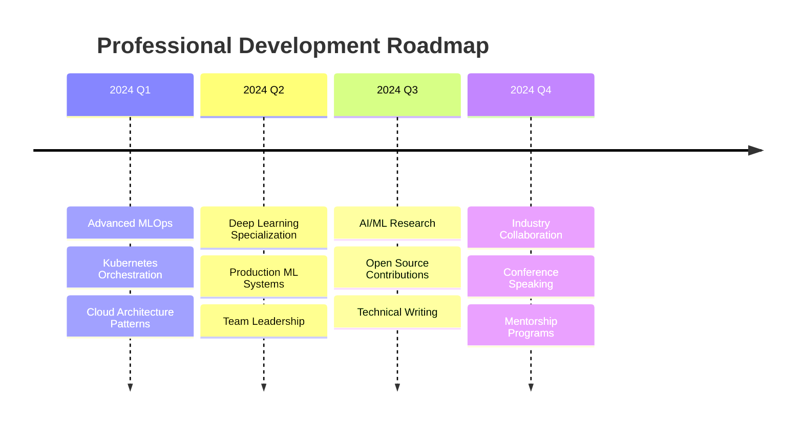

# Muhammad Raza
## Data Scientist | MLOps Engineer | AI Solutions Architect

<div align="center">
  
  
  
  [](https://git.io/typing-svg)
  
</div>

<br>

<table width="100%">
<tr>
<td width="50%" valign="top">

### 🎯 **Professional Overview**

**Computer Systems Engineering Student** at **MUET Jamshoro**  
**CGPA: 3.59/4.0** | **Co-Lead, IEEE Xtreme Karachi Section**

Specializing in **production-grade machine learning systems** with expertise in **MLOps**, **cloud architecture**, and **scalable AI deployment**. Passionate about bridging the gap between research and real-world applications.

**Core Competencies:**
- End-to-end ML pipeline development
- Production model deployment & monitoring  
- Cloud-native AI architecture
- Data engineering & ETL processes
- Team leadership & technical mentorship

</td>
<td width="50%" valign="top">

### 📊 **Impact Metrics**

```
📈 Projects Deployed:        15+ ML Models
🚀 Production Systems:       8+ Live Applications  
⚡ Model Performance:        95%+ Accuracy Average
🔄 Pipeline Automation:      100% CI/CD Coverage
📚 Technical Articles:       12+ Published
👥 Teams Led:               5+ Cross-functional
```

**Recent Achievements:**
- 🥉 **National Recognition** - 3rd Place, All Pakistan Physics Project Competition
- 🏅 **Academic Excellence** - 6th Position, Intermediate ICS
- 💼 **Industry Experience** - CodeSoft, Clickworker

</td>
</tr>
</table>

---

## 🏗️ **Technical Architecture**

<div align="center">

### **Core Technology Stack**

</div>

<table>
<tr>
<td align="center" width="20%">

**Data Science & ML**
<br><br>


</td>
<td align="center" width="20%">

**MLOps & Deployment**
<br><br>


</td>
<td align="center" width="20%">

**Cloud & Infrastructure**
<br><br>


</td>
<td align="center" width="20%">

**Backend & APIs**
<br><br>


</td>
<td align="center" width="20%">

**Data Visualization**
<br><br>


</td>
</tr>
</table>

---

## 📈 **Performance Analytics**

<div align="center">
  
  
  
  
</div>

<div align="center">
  
  
  
</div>

<details>
<summary><b>📊 Detailed Language Statistics</b></summary>
<br>

<div align="center">
  
  
  
</div>

</details>

---

## 🏆 **Recognition & Achievements**

<div align="center">
  
  
  
</div>

---

## 🔬 **Areas of Expertise**

<table width="100%">
<tr>
<td width="33%" valign="top">

### **Machine Learning Engineering**
- Model architecture design & optimization
- Feature engineering & selection
- Hyperparameter tuning & AutoML
- A/B testing for ML models
- Model interpretability & explainability

</td>
<td width="33%" valign="top">

### **MLOps & Production Systems**
- CI/CD pipeline automation
- Model versioning & experiment tracking  
- Container orchestration & scaling
- Monitoring & alerting systems
- Infrastructure as Code (IaC)

</td>
<td width="33%" valign="top">

### **Data Engineering**
- ETL/ELT pipeline development
- Real-time data processing
- Data warehouse design
- API development & integration
- Database optimization

</td>
</tr>
</table>

---

## 🎓 **Continuous Learning Journey**

<div align="center">



</div>

---

## 🤝 **Professional Network**

<div align="center">
  
  [](https://www.linkedin.com/in/raza-khan-922612296/)
  [](https://razakhan143.github.io/portfolio_website/index.html)
  [](mailto:razakhanzada100@gmail.com)
  [](https://github.com/Razakhan143)
  
  
  
</div>

---

<div align="center">
  
  ### 💡 *"Transforming complex data challenges into scalable AI solutions that drive business impact"*
  
  **Available for collaboration on innovative ML projects and consulting opportunities**
  
  
  
</div>
